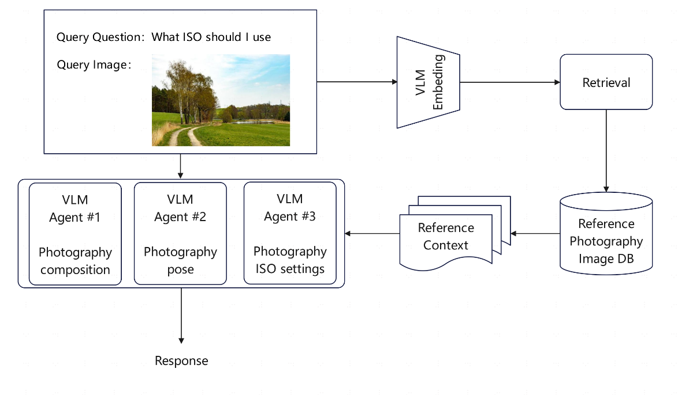

# AI assist photo taking

## Abstract
Users with no training in photography are often unable to capture attractive photographs. This project utilizes AI to automatically analyze frame elements and generate instructions that guide users in capturing better photographs.  In detail，this project is an application of a visual language model based on RAG and Agent technique. It can address users' photography questions by querying professional photography reference image libraries, and provide professional photography suggestions based on reference photos, including composition, posing, ISO settings, and more.

## Pipeline

1. Pass the query image to the embedding model to semantically represent it as an embedded query vector.

2. Pass the embedded query vector to reference professional photography DB.

3. Retrieve the top-k relevant photo – measured by distance between the query embedding and all the embedded photo in the database.

4. Pass the query question，query image and retrieved photo to our VLM model.

5. The VLM model will determine which agent should be used，including composition agent，posing agent and ISO setting agent.

6. The VLM model generate a response with agent using the retrieved referencecontext.

## Requirements

transformers 4.37.2

gradio 4.38.0

SQLAlchemy 2.0.31

## Run

The RAG backend used in this project is based on [MaterialSearch](https://github.com/chn-lee-yumi/MaterialSearch "MaterialSearch"). So fistly run main.py in MaterialSerch folder to start RAG backend.

Then run demo_gradio_agent.py to start gradio webui.